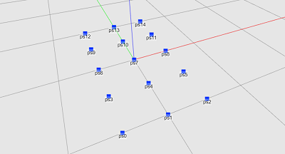
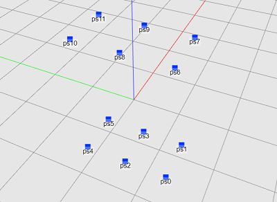
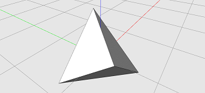

# PATTERN  
  
The `pattern` module has functions for creating patterns of positions.
These functions all return lists of position IDs.
The list may be nested, depending on which function is selected.  
  
  
## Line  
  
  
**Description:** Creates a set of positions in a straight line pattern.


The `origin` parameter specifies the centre of the straight line along which positions will be
generated. The origin can be specified as either a <abbr title='A list of three numbers, [x, y, z]'>coordinate</abbr> or a <abbr title='Three lists of three numbers, [origin, x-axis, y-axis]'>plane</abbr>. If a coordinate
is given, then a plane will be automatically generated, aligned with the global XY plane.


The positions will be generated along a straight line aligned with the X axis of the origin
plane.


Returns the list of new positions.

  
  
**Parameters:**  
  * *origin:* A <abbr title='A list of three numbers, [x, y, z]'>coordinate</abbr> or a <abbr title='Three lists of three numbers, [origin, x-axis, y-axis]'>plane</abbr>.
If a coordinate is given, then the plane is assumed to be aligned with the global XY plane.  
  * *length:* A number. The length of the line along which positions will be generated.  
  * *num\_positions:* An integer. The number of positions to be generated.  
  
**Returns:** Entities, a list of new positions.  
  
  
## Linear  
  
  
**Description:** Creates a set of positions by linear interpolation between the specified coordinates. 
 The
`num_positions` parameter specifies the number of positions to be generated between each pair of
coordinates. 
 The `method` parameter specifies whether to close the loop of coordinates. If set
to `close`, then positions are also generated between the last and first coordinates in the list.

 For the `num_positions` parameters:
- `num_positions = 0`: No positions are generated.
- `num_positions = 1`: No new coordinates are calculated. If `close` is true, then positions are
  generated at all coordinates in the input list. If `close` is false, then positions are
  generated at all coordinates in the input list except the last coordinate (which is ignored).
- `num_positions = 2`: No new coordinates are calculated. Positions are generated at all
  coordinates in the input list. (The `close` parameter has no effect.)
- `num_positions = 3`: For each pair of coordinates, one additional coordinate is calculated by
  linear interpolation.
- `num_positions = 4`: For each pair of coordinates, two additional coordinates are calculated by
  linear interpolation.
- etc
 

 For example, lets consider a case where you specify three coordinates, set the method to
  `close` and set `num_positions` to 4. In this case, there will be 3 pairs of coordinates, `[0,
  1]`, `[1, 2]` and `[2, 0]`. For each pair of coordinates, 2 new calculations are calculated.
  This results in a total of 9 coordinates. So 9 positions will be generated. 
 Returns the list
  of new position IDs. 
  
  
**Parameters:**  
  * *coords:* A list of coordinates.  
  * *close:* Enum, `'open'` or `'close'`.  
  * *num\_positions:* The number of positions to generate.  
  
**Returns:** Entities, a list of new position IDs.  
**Examples:**  
  * `posis = pattern.Linear([[0,0,0], [10,0,0]], false, 3)`  
    Generates 3 positions, located at [0,0,0], [5,0,0], and [10,0,0].  
  * `posis = pattern.Linear([[0,0,0], [10,0,0], [10,10,0]], 'close', 4)`  
    Generates 9 positions. Two new coordinates are calculated between each pair of
input positions.
  
  
  
## Rectangle  
  
  
**Description:** Creates four positions in a rectangle pattern.


The `origin` parameter specifies the centre of the rectangle for which positions will be
generated. The origin can be specified as either a <abbr title='A list of three numbers, [x, y, z]'>coordinate</abbr> or a <abbr title='Three lists of three numbers, [origin, x-axis, y-axis]'>plane</abbr>. If a coordinate
is given, then a plane will be automatically generated, aligned with the global XY plane.


The positions will be generated for a rectangle on the origin XY plane. So if the origin plane is
rotated, then the rectangle will also be rotated.


The `size` parameter specifies the size of the rectangle. If only one number is given,
then width and length are assumed to be equal. If a list of two numbers is given,
then they will be interpreted as `[width, length]`.The width dimension will be in the
X-direction of the origin plane, and the length will be in the Y direction of the origin plane.


Returns a list of new positions.

  
  
**Parameters:**  
  * *origin:* A <abbr title='A list of three numbers, [x, y, z]'>coordinate</abbr> or a <abbr title='Three lists of three numbers, [origin, x-axis, y-axis]'>plane</abbr>.
If a coordinate is given, then the plane is assumed to be aligned with the global XY plane.  
  * *size:* Size of rectangle. If number, assume square of that length;
if list of two numbers, x and y lengths respectively.  
  
**Returns:** Entities, a list of four positions.  
**Examples:**  
  * `posis = pattern.Rectangle([0,0,0], 10)`  
    Creates a list of 4 coords, being the vertices of a 10 by 10 square.  
  * `posis = pattern.Rectangle(XY, [10,20])`  
    Creates a list of 4 positions in a rectangle pattern. The rectangle has a width of
10 (in the X direction) and a length of 20 (in the Y direction).
  
  
  
## Grid  
  
  
**Description:** Creates positions in a grid pattern.


The `origin` parameter specifies the centre of the grid for which positions will be
generated. The origin can be specified as either a <abbr title='A list of three numbers, [x, y, z]'>coordinate</abbr> or a <abbr title='Three lists of three numbers, [origin, x-axis, y-axis]'>plane</abbr>. If a coordinate
is given, then a plane will be automatically generated, aligned with the global XY plane.


The positions will be generated for a grid on the origin XY plane. So if the origin plane is
rotated, then the grid will also be rotated.


The `size` parameter specifies the size of the grid.
- If only one number is given, then width and length are assumed to be equal.
- If a list of two numbers is given, then they will be interpreted as `[width, length]`.


The width dimension will be in the X-direction of the origin plane, and the length will be in
the Y direction of the origin plane.


The `num_positions` parameter specifies the number of columns and rows of positions in the grid.
- If only one number is given, then the grid is assumed to have equal number columns and rows.
- If a list of two numbers is given, then they will be interpreted as `[columns, rows]`.


The `columns` will be parallel to the Y-direction of the origin plane,
and the `rows` will be parallel to the X-direction of the origin plane.


For example, consider the following function call:
`posis = pattern.Grid(XY, [10, 20], [3, 5], 'flat')`
This will generate the following grid:





The positions can either be returned as a flat list or as nested lists.
For the nested lists, three options are available:
- `columns`: Each nested list represents a column of positions.
- `rows`: Each nested list represents a row of positions.
- `quads`: Each nested list represents four positions, forming a quadrilateral. Neighbouring
quadrilaterals share positions.


Below are the varying results when calling the function with the method set to
`flat`, `columns`, `rows` and `quads`:


`posis = pattern.Grid(XY, [10,20], [2,3], 'flat')`
```
posis = ["ps0", "ps1", "ps2", "ps3", "ps4", "ps5"]
```


`posis = pattern.Grid(XY, [10,20], [2,3], 'columns')`
```
posis = [
    ["ps0", "ps2", "ps4"],
    ["ps1", "ps3", "ps5"]
]
```


`posis = pattern.Grid(XY, [10,20], [2,3], 'rows')`
```
posis = [
    ["ps0", "ps1"],
    ["ps2", "ps3"],
    ["ps4", "ps5"]
]
```


`posis = pattern.Grid(XY, [10,20], [2,3], 'quads')`
```
posis = [
    ["ps0", "ps1", "ps3", "ps2"],
    ["ps2", "ps3", "ps5", "ps4"]
]
```


When the method is set to `columns` or `rows`, polylines can be generated as follows:
```
posis = pattern.Grid(XY, [10,20], [2,3], 'rows')
plines = make.Polyline(posis, 'open')
```
When the method is set to quads, polygons can be generated as follows:
```
posis = pattern.Grid(XY, [10,20], [2,3], 'quads')
pgons = make.Polygon(posis)
```

  
  
**Parameters:**  
  * *origin:* A <abbr title='A list of three numbers, [x, y, z]'>coordinate</abbr> or a <abbr title='Three lists of three numbers, [origin, x-axis, y-axis]'>plane</abbr>.
If a coordinate is given, then the plane is assumed to be aligned with the global XY plane.  
  * *size:* The width and length of grid.
If a single number is given, then the width and length are assumed to be equal.
If a list of two numbers is given, then they will be interpreted as `[width, length]`.  
  * *num\_positions:* Number of columns and rows of positions in the grid.
If a single number is given, then the number of columns and rows are assumed to be equal.
If a list of two numbers is given, then they will be interpreted as `[columns, rows]`.  
  * *method:* Enum, define the way the coords will be return as lists: `'flat', 'rows',
'columns'` or `'quads'`.  
  
**Returns:** Entities, a list of positions, or a list of lists of positions
(depending on the 'method' setting).  
**Examples:**  
  * `posis = pattern.Grid([0,0,0], 10, 3, 'flat')`  
    Creates a list of 9 positions on a 3x3 square grid with a size of 10.  
  * `posis = pattern.Grid([0,0,0], [10,20], [3,4], 'flat')`  
    Creates a list of 12 positions on a 3x4 grid. The grid as a width of 10
and a length of 20. The positions are returned as a flat list.
  
  
  
## Box  
  
  
**Description:** Creates positions in a box pattern. Positions are only generated on the outer surface of the box.
No positions are generated in the interior of the box.


The `origin` parameter specifies the centre of the box for which positions will be
generated. The origin can be specified as either a <abbr title='A list of three numbers, [x, y, z]'>coordinate</abbr> or a <abbr title='Three lists of three numbers, [origin, x-axis, y-axis]'>plane</abbr>. If a coordinate
is given, then a plane will be automatically generated, aligned with the global XY plane.


The positions will be generated for a box aligned with the origin XY plane.
So if the origin plane is rotated, then the box will also be rotated.


The `size` parameter specifies the size of the box.
- If only one number is given, then the width, length, and height are assumed to be equal.
- If a list of two numbers is given, then they will be interpreted as `[width, length]`,
and the height will be the same as the length.
- If a list of three numbers is given, then they will be interpreted as `[width, length, height]`.


The width dimension will be in the X-direction of the origin plane,
the length in the Y direction, and the height in the Z-direction.


The `num_positions` parameter specifies the number of columns, rows, and layers of positions
in the box.
- If only one number is given, then the box is assumed to have equal number columns, rows,
and layers.
- If a list of two numbers is given, then they will be interpreted as `[columns, rows]`,
and the number of layers will be the same as the rows.
- If a list of three numbers is given, then they will be interpreted as `[columns, rows, layers]`.


The `columns` will be parallel to the Y-direction of the origin plane,
and the `rows` will be parallel to the X-direction of the origin plane.
The layers are stacked up in the Z-direction of the origin plane.


For example, consider the following function call:
`posis = pattern.Box(XY, [10,20,30], [2,3,2], 'flat')`
This will generate the following box:





Below are the varying results when calling the function with the method set to
`flat`, `columns`, `rows` `layers` and `quads`:


`posis = pattern.Box(XY, [10,20,30], [2,3,2], 'flat')`
```
posis = ["ps0", "ps1", "ps2", "ps3", "ps4", "ps5", "ps6", "ps7", "ps8", "ps9", "ps10", "ps11"]
```


`posis = pattern.Grid(XY, [10,20,30], [2,3,2], 'columns')`
```
posis = [
    ["ps0", "ps1", "ps6", "ps7"],
    ["ps2", "ps3", "ps8", "ps9"],
    ["ps4", "ps5", "ps10", "ps11"]
]
```


`posis = pattern.Grid(XY, [10,20,30], [2,3,2], 'rows')`
```
posis = [
    ["ps0", "ps2", "ps4", "ps6", "ps8", "ps10"],
    ["ps1", "ps3", "ps5", "ps7", "ps9", "ps11"]
]
```


`posis = pattern.Grid(XY, [10,20,30], [2,3,2], 'layers')`
```
posis = [
    ["ps0", "ps1", "ps2", "ps3", "ps4", "ps5"],
    ["ps6", "ps7", "ps8", "ps9", "ps10", "ps11"]
]
```


`posis = pattern.Grid(XY, [10,20,30], [2,3,2], 'quads')`
```
posis = [
    ["ps0", "ps2", "ps3", "ps1"],
    ["ps2", "ps4", "ps5", "ps3"],
    ["ps0", "ps1", "ps7", "ps6"],
    ["ps1", "ps3", "ps9", "ps7"],
    ["ps3", "ps5", "ps11", "ps9"],
    ["ps5", "ps4", "ps10", "ps11"],
    ["ps4", "ps2", "ps8", "ps10"],
    ["ps2", "ps0", "ps6", "ps8"],
    ["ps6", "ps7", "ps9", "ps8"],
    ["ps8", "ps9", "ps11", "ps10"]
]
```


When the method is set to `columns` or `rows`, polylines can be generated as follows:
```
posis = pattern.Box(XY, [10,20,30], [2,3,2], 'rows')
plines = make.Polyline(posis, 'open')
```
When the method is set to quads, polygons on the box surface can be generated as follows:
```
posis = pattern.Grid(XY, [10,20,30], [2,3,2], 'quads')
pgons = make.Polygon(posis)
```

  
  
**Parameters:**  
  * *origin:* A <abbr title='A list of three numbers, [x, y, z]'>coordinate</abbr> or a <abbr title='Three lists of three numbers, [origin, x-axis, y-axis]'>plane</abbr>.
If a coordinate is given, then the plane is assumed to be aligned with the global XY plane.  
  * *size:* The width, length, and height of the box.
If a single number is given, then the width, length, and height are assumed to be equal.
If a list of two numbers is given, then they will be interpreted as `[width, length]`,
and the height is assumed to be equal to the length.
If a list of three numbers is given, then they will be interpreted as `[width, length, height]`.  
  * *num\_positions:* Number of columns, rows, and layers of positions in the box.
If a single number is given, then the number of columns, rows, and layers are assumed to be equal.
If a list of two numbers is given, then they will be interpreted as `[columns, rows]`,
and the number of layers is assumed to be equal to the number of rows.
If a list of three numbers is given, then they will be interpreted as `[columns, rows, layers]`.  
  * *method:* Enum, define the way the coords will be returned as lists: `'flat', 'rows',
'columns', 'layers'` or `'quads'`.  
  
**Returns:** Entities, a list of positions, or a list of lists of positions
(depending on the 'method' setting).  
**Examples:**  
  * `posis = pattern.Box(XY, [10,20,30], [3,4,5], 'quads')`  
    Returns positions in a box pattern. The size of the box is 10 wide (in X direction)
20 long (Y direction), and 30 high (Z direction). The box has 3 columns, 4 rows, and 5 layers.
This results in a total of 12 (i.e. 3 x 4) positions in the top and bottom layers, and 10
positions in the middle two layers. The positions are returned as nested lists, where each
sub-list contains positions for one quadrilateral.
  
  
  
## Polyhedron  
  
  
**Description:** Creates positions in a polyhedron pattern.


The five regular polyhedrons can be generated:
- Tetrahedron (4 triangular faces)
- Cube (4 square faces)
- Octahedron (8 triangular faces)
- Icosahedron (20 triangular faces)
- Dodecahedron (12 pentagon faces)


The `origin` parameter specifies the centre of the polyhedron for which positions will be
generated. The origin can be specified as either a <abbr title='A list of three numbers, [x, y, z]'>coordinate</abbr> or a <abbr title='Three lists of three numbers, [origin, x-axis, y-axis]'>plane</abbr>. If a coordinate
is given, then a plane will be automatically generated, aligned with the global XY plane.


The positions will be generated for a polyhedron aligned with the origin XY plane.
So if the origin plane is rotated, then the polyhedron will also be rotated.


The `radius` parameter specifies the size of the polyhedron.
All positions that are generated are projected onto the surface of a sphere,
with the specified `radius`.


The faces of the regular polyhedron can be further subdivided by specifying the level of
`detail`. (When subdivided, it will no longer be regular polyhedrons.)


For tetrahedrons, octahedrons, and icosahedrons, the `detail` subdivides as follows:
- Detail = 0: No subdivision
- Detail = 1: Each triangle edge is subdivided into two edges.
- Detail = 2: Each triangle edge is subdivided into three edges.
- etc


Cubes and dodecahedrons do not have triangular faces. So in these cases, the first level of
`detail` converts each non-triangular face into triangles by adding a position at the centre of
the face. The `detail` subdivides as follows:
- Detail = 0: No subdivision.
- Detail = 1: Convert non-triangular faces into triangles.
- Detail = 2: Each triangle edge is subdivided into two edges.
- Detail = 3: Each triangle edge is subdivided into three edges.
- etc


The positions can either be returned as a flat list or as nested lists.
The nested lists represent the faces of the polyhedron.
However, note that only the positions are returned.
If you want to have polygon faces, you need to generate polygons from the positions.


For example, calling the function with `detail = 0` and `method = 'flat_tetra'`,
will result in the following positions:
```
posis = ["ps0", "ps1", "ps2", "ps3"]
```
If you change the method to `method = 'face_tetra'`, then you will get the following nested lists.
```
posis = [
    ["ps2", "ps1", "ps0"],
    ["ps0", "ps3", "ps2"],
    ["ps1", "ps3", "ps0"],
    ["ps2", "ps3", "ps1"]
]
```
Notice that the number of positions is the same in both cases
(i.e. in both cases there are 4 positions: 'ps0', 'ps1', 'ps2', 'ps3').
When `face_tetra` is selected selected, the positions are organised into 4 lists,
representing the 4 faces of the tetrahedron.


The nested lists can be passed to the `make.Polygon` function in order to generated polygonal faces.
Here is an example:


```
posis = pattern.Polyhedron(XY, 10, 0, 'face_tetra')
pgons = make.Polygon(posis)
```




  
  
**Parameters:**  
  * *origin:* A <abbr title='A list of three numbers, [x, y, z]'>coordinate</abbr> or a <abbr title='Three lists of three numbers, [origin, x-axis, y-axis]'>plane</abbr>, specifying the origin of the polyhedron.
If a coordinate is given, then the plane is assumed to be aligned with the global XY plane.  
  * *radius:* The radius of the polyhedron.  
  * *detail:* The level of detail for the polyhedron.  
  * *method:* Enum, the Type of polyhedron to generate: `'flat_tetra', 'flat_cube', 'flat_octa',
'flat_icosa', 'flat_dodeca', 'face_tetra', 'face_cube', 'face_octa', 'face_icosa'` or `'face_dodeca'`.  
  
**Returns:** Entities, a list of positions.  
**Examples:**  
  * `posis = pattern.Polyhedron(XY, 20, 0, 'face_tetra')`  
    Creates positions in a regular tetrahedron pattern, with a radius of 20. The
positions are returned as nested lists, where each list contains the positions for one face.
  
  
  
## Arc  
  
  
**Description:** Creates positions in an arc or circle pattern.


The `origin` parameter specifies the centre of the polyhedron for which positions will be
generated. The origin can be specified as either a <abbr title='A list of three numbers, [x, y, z]'>coordinate</abbr> or a <abbr title='Three lists of three numbers, [origin, x-axis, y-axis]'>plane</abbr>. If a coordinate
is given, then a plane will be automatically generated, aligned with the global XY plane.


The positions will be generated for an arc aligned with the origin XY plane.
So if the origin plane is rotated, then the rotated will also be rotated.


The `radius` parameter specifies the size of the arc.


The `num_positions` parameter specifies the total number of positions to be generated on the arc.


The `arc_angle` specifies the angle of the arc, in radians. Angles start at the X-axis of the
origin plane and move in a counter-clockwise direction. Two angles are needed to define an arc,
a `start_angle` and `end_angle`. The angles may be positive or negative, and may be
greater than `2*PI` or smaller than `-2*PI`.


Positions will always be generated in sequence, from the start angle towards the end angle.
- If the start angle is smaller than the end angle, then the positions will be generated in
counter-clockwise order.
- If the start angle is greater than the end angle, then the positions will be generated in
clockwise order.


The angle may either be given as a single number, as a list of two numbers, or as `null`:
- If the angle is given as a single number, then the arc angles will be set to be
`[0, end_angle]`. This means that the start of the arc will coincide with the X-axis
of the origin plane.
- If the angle is given as a list of two numbers, then they will be set to be
`[start_angle, end_angle]`.
- If the angle is set to `null`, then the arc angles will be set to be
`[0, 2*PI]`. In addition, duplicate positions at start and end of the arc are
automatically removed.


Note that setting the arc angle to null is not the same as setting it to `2*PI`.
When setting the arc angle to `2*PI`, you will get duplicate positions at the start and end
of the arc.

  
  
**Parameters:**  
  * *origin:* A <abbr title='A list of three numbers, [x, y, z]'>coordinate</abbr> or a <abbr title='Three lists of three numbers, [origin, x-axis, y-axis]'>plane</abbr>, specifying the centre of the arc.
If a coordinate is given, then the plane is assumed to be aligned with the global XY plane.  
  * *radius:* Radius of circle as a number.  
  * *num\_positions:* Number of positions to be distributed equally along the arc.  
  * *arc\_angle:* Angle of arc (in radians). If a list of two numbers is given, then the first
number specifies the arc start angle, and the second number the arc end angle, i.e.
`[arc_start_angle, arc_end_angle]`. If a single numer is specified, then the angles will be set
to `[0, arc_end_angle]`. If `null` is given, then the angles will be set to `[0, 2 * PI]`.  
  
**Returns:** Entities, a list of positions.  
**Examples:**  
  * `posis = pattern.Arc([0,0,0], 10, 12, PI)`  
    Creates a list of 12 positions distributed equally along a semicircle of radius 10
starting at an angle of 0 and ending at an angle of 180 degrees, rotating in a counter-clockwise
direction.
  
  
  
## Bezier  
  
  
**Description:** Creates positions in a Bezier curve pattern, defined by a list of coordinates.


The Bezier is created as either a quadratic or cubic Bezier. It is always an open curve.


The positions are created along the curve at equal parameter values.
This means that the euclidean distance between the positions will not necessarily be equal.


For the quadratic Bezier, three coordinates are required.
For the cubic Bezier, four coordinates are required.


The `coords` parameter gives the list of coordinates
(three coords for quadratics, four coords for cubics).
The first and last coordinates in the list are the start and end positions of the curve.
The middle coordinates act as the control points for controlling the shape of the curve.


The `num_positions` parameter specifies the total number of positions to be generated.


For more information, see the wikipedia article:
<a href="https://en.wikipedia.org/wiki/B%C3%A9zier_curve" target="_blank">Bezier_curve</a>.

  
  
**Parameters:**  
  * *coords:* A <abbr title='A list of three numbers, [x, y, z]'>coordinate</abbr> or a <abbr title='Three lists of three numbers, [origin, x-axis, y-axis]'>plane</abbr> (three coords for quadratics, four coords for cubics).
If a coordinate is given, then the plane is assumed to be aligned with the global XY plane.  
  * *num\_positions:* Number of positions to be distributed along the Bezier.  
  
**Returns:** Entities, a list of positions.  
**Examples:**  
  * `posis = pattern.Bezier([[0,0,0], [10,0,50], [20,0,0]], 20)`  
    Creates a list of 20 positions distributed along a Bezier curve.
  
  
  
## Nurbs  
  
  
**Description:** Creates positions in a NURBS curve pattern, defined by a list of coordinates.


The positions are created along the curve according to the parametric equation of the curve.
This means that the euclidean distance between the positions will not necessarily be equal.
For open BSpline curves, the positions at the start and end tend to be closer together.


The `coords` parameter gives the list of coordinates for generating the curve.
- If the curve is open, then the first and last coordinates in the list are the start and end
positions of the curve. The middle coordinates act as the control points for controlling the
shape of the curve.
- If the curve is closed, then all coordinates act as the control points for controlling the
shape of the curve.


The degree (between 2 and 5) of the curve defines how smooth the curve is.
Quadratic: degree = 2
Cubic: degree = 3
Quartic: degree = 4.


The number of coordinates should be at least one greater than the degree of the curve.


The `num_positions` parameter specifies the total number of positions to be generated.

  
  
**Parameters:**  
  * *coords:* A list of coordinates (must be at least three).  
  * *degree:* The degree of the curve, an integer between 2 and 5.  
  * *close:* Enum, `'close'` or `'open'`.  
  * *num\_positions:* Number of positions to be distributed along the Bezier.  
  
**Returns:** Entities, a list of positions.  
**Examples:**  
  * `posis = pattern.Nurbs([[0,0,0], [10,0,50], [20,0,50], [30,0,0]], 3, 'open', 20)`  
    Creates a list of 20 positions distributed along a Nurbs curve.
  
  
  
## Interpolate  
  
  
**Description:** Creates positions in a spline pattern. Returns a list of new positions.
It is a type of interpolating spline (a curve that goes through its control points).


The input is a list of XYZ coordinates. These act as the control points for creating the Spline curve.
The positions that get generated will be divided equally between the control points.
For example, if you define 4 control points for a closed spline, and set 'num_positions' to be 40,
then you will get 8 positions between each pair of control points,
irrespective of the distance between the control points.


The spline curve can be created in three ways: 'centripetal', 'chordal', or 'catmullrom'.


For more information, see the wikipedia article:
<a href="https://en.wikipedia.org/wiki/Centripetal_Catmull%E2%80%93Rom_spline">Catmull–Rom spline</a>.


  
  
**Parameters:**  
  * *coords:* A list of coordinates.  
  * *type:* Enum, the type of interpolation algorithm: 'centripetal', 'chordal', or 'catmullrom'.  
  * *tension:* Curve tension, between 0 and 1. This only has an effect when the 'type' is set
to 'catmullrom'.  
  * *close:* Enum, `'open'` or `'close'`.  
  * *num\_positions:* Number of positions to be distributed distributed along the spline.  
  
**Returns:** Entities, a list of positions.  
**Examples:**  
  * `posis = pattern.Spline([[0,0,0], [10,0,50], [20,0,0], [30,0,20], [40,0,10]],
'chordal','close', 0.2, 50)`  
    Creates a list of 50 positions distributed along a spline curve pattern.
  
  
  
